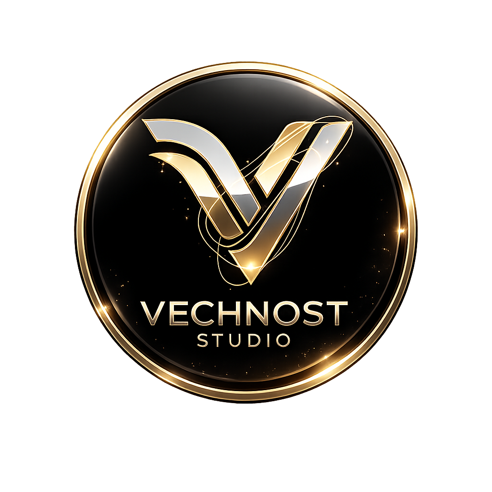

<div align="center">
  
  <h1>VNS Asset Manager 🚀</h1>
  <p><b>The Ultimate Bulk Asset Uploader & Manager for Roblox Developers</b></p>
</div>

<div align="center">
  <a href="https://discord.gg/sBjZA88Ywa">
    
  </a>
</div>

---

## 📖 Overview

**VNS Asset Manager** is a professional desktop application designed exclusively for Roblox Developers and Studios. It streamlines the tedious process of uploading and managing hundreds of audio and animation assets by automating the pipeline, bypassing strict format limitations, and providing a powerful tagging library to keep your workspace organized.

Built with performance and security in mind, VNS Asset Manager uses a modern tech stack (Electron + React + Vite) to deliver a lightning-fast, premium desktop experience.

---

## ✨ Core Features

* 🎶 **Smart Bulk Audio Uploader** 
  Upload hundreds of `.mp3` or `.ogg` files automatically. Built-in FFmpeg integration auto-converts unsupported formats on the fly before uploading to Roblox.
  
* 🥷 **Stealth Audio Engine (Bypass Tech)**
  An advanced, built-in FFmpeg processing suite designed to evade automated copyright and moderation bots (Audible Magic & Content ID). Features multiple tiers of evasion (Stealth, Ghost, Phantom, and the maximum-risk **God Mode**), utilizing techniques like phase decorrelation, sub-harmonic masking, pitch/tempo micro-shifts, and spectral reconstruction.
  
* 🏃‍♂️ **Animation Uploader & Marketplace Downloader** 
  Browse the Roblox Marketplace directly from the app, download public animations, and seamlessly push animation files (`.rbxm`) directly to your Roblox account or Group. Bypass Studio entirely.
  
* 🔌 **Live Studio Sync & Auto-Replace**
  Connect the app directly to Roblox Studio via a local plugin. After bulk reuploading assets, click "Save to Game" to automatically scan your workspace and replace all old Asset IDs with the newly uploaded IDs in seconds!
  
* 🏷️ **Advanced Asset Library & Tagging System** 
  All uploaded assets are automatically saved to your local library. Add custom tags, filter by categories, instantly search your history, and copy Asset IDs with a single click. Includes a built-in audio preview player.

* 👥 **Multi-Account Management** 
  Save multiple `.ROBLOSECURITY` cookies securely on your device. Switch between alt accounts or group holder accounts instantly during mass uploads to avoid rate limits.

* 📊 **Analytics & Success Dashboard** 
  Monitor your upload success rates, track your 7-day activity, view system health (Roblox Open Cloud API latency & FFmpeg status), and manage your local cache storage.

* 🔒 **Military-Grade Security (KeyAuth)** 
  Enterprise-level licensing system locked to the user's Hardware ID (HWID). Protects the software from being cracked or redistributed.

* 🎮 **Discord Rich Presence (RPC)** 
  Show off your workflow! Your Discord status automatically updates to show when you're uploading files, browsing your library, or managing settings.

* ⏱️ **Scheduled Bulk Uploads & Real-Time Queue** 
  Need to bypass heavy rate limits? Queue your files and schedule them to automatically upload in the background at specific intervals (e.g. 5-10 mins). Features a global real-time sidebar notification badge and automatic background polling to check Roblox Moderation (Review) status without manual refreshes.

* 📜 **1-Click Luau Export**
  Select multiple assets from your history and instantly export them as a formatted `.luau` dictionary script, ready to be pasted straight into your Roblox game's codebase.

* 🎬 **Video Engine (Video-to-Roblox)**
  Convert MP4/WebM videos into optimized Spritesheets! The engine automatically splits frames, calculates ImageRectOffsets, and generates a ready-to-use Luau script to play videos seamlessly inside Roblox using GUI or Decals.

* 🌌 **Skybox 360 to Cubemap Generator (Lanczos5 Interpolation)**
  Upload a single 360-degree equirectangular panorama image (PNG, JPG, WebP) and the engine will mathematically project and slice it into the perfect 6-face standard cubemap format (`SkyboxFt`, `SkyboxBk`, `SkyboxLf`, `SkyboxRt`, `SkyboxUp`, `SkyboxDn`). Features **Lanczos5 interpolation** for maximum sharpness without aliasing, and includes built-in AI prompt generation tips! Automatically pushes all 6 textures via Open Cloud and creates a seamless Sky object in your Studio workspace!

* 🧩 **UI Spritesheet Packer**
  Drag & drop multiple UI icons (PNG/JPG) to automatically pack them into a single optimized 1024x1024 texture atlas using the MaxRects bin packing algorithm. Generates a Luau script mapping all ImageRectOffsets and ImageRectSizes instantly!

* 🌐 **Direct URL Audio Downloader**
  Paste links from YouTube, Spotify, or SoundCloud. The app will automatically download, convert, and process the audio, then push it straight into your Roblox inventory without ever touching your browser.

* 🧱 **PBR Material Builder**
  Upload Albedo, Normal, Roughness, and Metalness maps in bulk. The app automatically links them and generates the necessary Luau module for instant SurfaceAppearance implementation.

* 🐑 **Asset Cloner**
  Instantly clone public uncopylocked assets (Audio, Decals, Meshes) directly to your own account or Group inventory to protect against random deletions by the original creators.

* 🗑️ **Inventory Sweeper (Bulk Archiver)**
  A powerful inventory management tool to clean up your account. View all your created assets in a visual gallery, multi-select unwanted assets, and archive them in bulk to keep your Roblox inventory clutter-free.

* 🔄 **Seamless Auto-Updater**
  Never miss a patch! VNS Asset Manager silently downloads new updates in the background and gracefully prompts you when a new version is ready to be installed.

---

## 💳 Subscription Tiers

VNS Asset Manager offers flexible pricing to suit every developer, from beginners to massive studios. *(Prices for Indonesian region)*

| Features | 🛡️ FREE | ⚡ SILVER (7 Days) | 🌟 GOLD (1 Month) | 👑 DIAMOND (1 Month) |
| :--- | :--- | :--- | :--- | :--- |
| **Price** | Gratis | Rp 50.000 | Rp 149.000 | Rp 399.000 |
| **Daily Upload Limit** | 50 Assets | 500 Assets | 2,000 Assets | **Unlimited** |
| **Uploader Accounts** | 1 Account | 3 Accounts | 10 Accounts | **Unlimited** |
| **Stealth Engine (Bypass)**| ❌ Standard | ✅ Stealth & Ghost | ✅ All (Inc. God Mode) | ✅ All Modes |
| **Scheduled Uploads** | ❌ Locked | ✅ 50 queue max | ✅ 500 queue max | ✅ Unlimited Queue |
| **UI Spritesheet Packer** | ✅ Max 512x512 | ✅ Full 1024x1024 | ✅ Full 1024x1024 | ✅ Full 1024x1024 |
| **Skybox Generator** | ❌ Locked | ✅ Max 512x512 | ✅ High (1024x1024) | ✅ High (1024x1024) |
| **Live Studio Sync** | ❌ Locked | ✅ Unlocked | ✅ Unlocked | ✅ Unlocked |
| **Asset Cloner** | ❌ Locked | ❌ Locked | ✅ 100 clones/day | ✅ **Unlimited** |
| **Video Engine** | ❌ Locked | ✅ Low (15 FPS) | ✅ High (30 FPS) | ✅ Extreme (60 FPS) |
| **Cookie Rotation** | ❌ Locked | ❌ Locked | ❌ Locked | ✅ **Exclusive** |

---

## 🛠️ Technology Stack

* **Frontend:** React 19, TypeScript, Vite, TailwindCSS (Dark-theme UI with Glassmorphism)
* **Backend:** Electron (Node.js), IPC Architecture
* **Security:** KeyAuth (License & HWID Auth), Node Machine ID
* **Media Processing:** FFmpeg (via `@ffmpeg-installer/ffmpeg`)
* **Database / Storage:** `electron-store` (Encrypted local persistence)

---

## 💻 System Requirements

VNS Asset Manager is designed to be lightweight but handles intensive tasks like bulk audio conversion.

* **Operating System:** Windows 10 / Windows 11 (64-bit)
* **Processor:** Intel Core i3 / AMD Ryzen 3 (or equivalent)
* **Memory (RAM):** 4 GB Minimum (8 GB Recommended for bulk processing)
* **Storage:** 200 MB for installation (additional SSD space recommended for the local asset library and FFmpeg caching)
* **Network:** Stable broadband internet connection for communicating with Roblox Open Cloud APIs

---

## 🚀 Getting Started

### Installation
1. Go to the [Releases](../../releases) page.
2. Download the latest `VNS-Asset-Manager-Setup-X.X.X.exe`.
3. Run the installer and open the app.
4. Login via Discord and enter your License Key.

### Development Setup
If you are contributing to the source code:

```bash
# 1. Clone the repository
git clone https://github.com/NavisAL04/VNS-AssetManager.git

# 2. Install dependencies
npm install

# 3. Create .env file based on .env.example
# Fill in your Discord Client ID and KeyAuth Credentials

# 4. Start the development server
npm run dev

# 5. Build for production (Generates .exe)
npm run publish
```

---

## 🛡️ Security Note
Your `.ROBLOSECURITY` cookies are **never** sent to any external server. They are encrypted and stored purely on your local machine using `electron-store` and are only used to communicate directly with the official Roblox APIs.

---

<div align="center">
  <i>Developed with ❤️ by Vechnost Studio</i>
</div>
